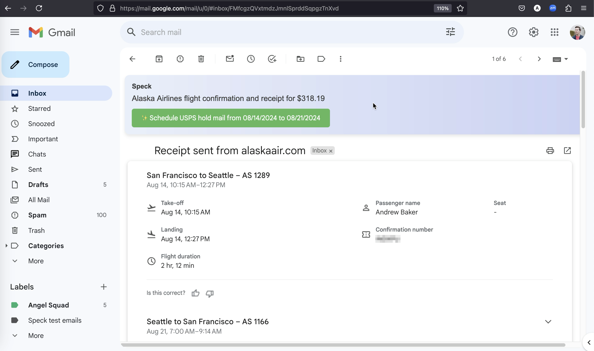

# Speck



**Speck is an open-source, privacy-first local AI agent application.**

Speck is currently a proof of concept. Speck will change a lot as it moves towards an MVP release, targeted for fall 2024.

**You can still download, install, and try Speck yourself, however.** Here's what the Speck proof of concept can do:

- Install and run entirely locally on your macOS or Windows device
- Download and configure a locally-running LLM to use for inference (using [Llamafile](https://github.com/Mozilla-Ocho/llamafile))
- Connect your Gmail inbox via Google OAuth
- Sync a local copy of your inbox and analyze it using the LLM
- Augment the Gmail web UI with additional information and capabilities
- Generate a one-sentence summary for each email in your inbox
- Identify and surface to the user relevant "Speck Functions" — Speck's agent capabilities — based on the the contents of your emails
- Execute a Speck Function using arguments Speck identified and locally-running browser automation toolchain

Speck currently contains just a single prototype Speck Function, called "[USPS hold mail](https://github.com/atbaker/speck/blob/f597bedef796e55fd37f6befe851e8e1eff0a6bd/speck-server/speck/library/usps_hold_mail.py#L9)". If Speck determines the user will be away from home soon, it will offer to [hold their mail with USPS](https://www.usps.com/manage/hold-mail.htm) for the duration of their trip.

**Follow the [Quickstart](#quickstart) instructions to install Speck on your machine and try it for yourself.** All the capabilities listed above should work, though the final step where Speck interacts with usps.com requires some additional configuration — reach out to me if you'd like to experience that feature.

Hit a snag in these instructions? Or maybe you have questions or thoughts? [Either way, I'd love to chat — please reach out!](https://www.linkedin.com/in/andrewtorkbaker/)

## Quickstart

The easiest way to try Speck is to download and install the latest release. You'll need to install both the **Speck application** for your OS and the **Speck browser extension** in your browser.

> [!IMPORTANT]
> If you want to try Speck this way, you need to reach out to me (or [open an issue](https://github.com/atbaker/speck/issues)) so I can add your Google account to the Speck OAuth app's allowlist. Speck uses [Google OAuth](https://developers.google.com/identity/protocols/oauth2) to securely access your Gmail inbox. That OAuth app has not yet been reviewed and published by Google, so it's still in "testing" mode — which means only Google accounts I specify can use it.

**Speck application installation instructions**

Speck's releases currently contain prebuilt apps for macOS (arm64) and Windows:

- [macOS](#install-speck-on-macos)
- [Windows](#install-speck-on-windows)

Want to run Speck on a different OS / architecture? You can use the instructions below to [install and run Speck from source](#install-and-run-speck-from-source).

**Speck browser extension installation instructions**

The Speck browser extension currently supports Chrome and Firefox:

- [Chrome](#install-the-speck-chrome-extension)
- [Firefox](#install-the-speck-firefox-extension)

### Install Speck on macOS

Follow these instructions to install Speck on your Mac:

1. Download and unzip the Speck app `.zip` asset from [the latest Speck release](https://github.com/atbaker/speck/releases/latest). You want the filename that looks like `speck-app-darwin-arm64-0.0.1.zip`.

1. Start the `speck-app.app` file you extracted from the zip archive. You should see a window pop up with the Speck logo and a button which says "Connect Speck to your inbox".

1. Click the button to open your browser and authorize your local Speck installation to access your Gmail data.

> [!NOTE]
> Speck's integration with your Gmail account is private and secure by design. **Your email data will be stored and processed entirely locally on your device.** The credentials Speck uses to access your Gmail data are stored solely in your operating system's secure storage. **Your data is never transmitted to Speck's servers or any other party.**

When finished, Speck will sync a copy of your inbox locally and begin analyzing it. The best way to confirm everything is working correctly is to peek at Speck's log files, which are stored in `~/Library/Application\ Support/speck-app`:

```
tail -f ~/Library/Application\ Support/speck-app/logs/main.log # Electron process log
tail -f ~/Library/Application\ Support/speck-app/logs/speck.log # Primary Python process log
tail -f ~/Library/Application\ Support/speck-app/logs/worker.log # Worker Python process log, where most work happens
```

You can also use a SQLite UI like [DB Browser for SQLite](https://sqlitebrowser.org/) to inspect your Speck app's database and watch it that way. You can find your Speck installation's SQLite database at `~/Library/Application\ Support/speck-app/data/speck.db`.

To finish setting up Speck, follow the instructions below to install the Speck browser extension in your [Chrome](#install-the-speck-chrome-extension) or [Firefox](#install-the-speck-firefox-extension) browser.

### Install Speck on Windows

Follow these instructions to install Speck on your Windows PC:

1. Download the `.exe` asset from [the latest Speck release](https://github.com/atbaker/speck/releases/latest). You want the filename that looks like `speck-app-0.0.1.Setup.exe`.

> [!NOTE]
> Both your browser and Windows will likely display warnings that this `.exe` file is unknown and cannot be confirmed as safe. Click through those prompts to finish downloading the file (or, if that makes you feel uneasy, [you can install Speck from source](#install-and-run-speck-from-source)).

1. Open the `.exe` file you downloaded. After a moment, you should see Speck open a window with the Speck logo and a button which says "Connect Speck to your inbox".

1. Click the button to open your browser and authorize your local Speck installation to access your Gmail data.

> [!NOTE]
> Speck's integration with your Gmail account is private and secure by design. **Your email data will be stored and processed entirely locally on your device.** The credentials Speck uses to access your Gmail data are stored solely in your operating system's secure storage. **Your data is never transmitted to Speck's servers or any other party.**

When finished, Speck will sync a copy of your inbox locally and begin analyzing it. The best way to confirm everything is working correctly is to use PowerShell to peek at Speck's log files, which are stored in `C:\Users\<your username here>\AppData\Roaming\speck-app\logs`:

```
Get-Content $env:APPDATA\speck-app\logs\main.log -Wait -Tail 30 # Electron process log
Get-Content $env:APPDATA\speck-app\logs\speck.log -Wait -Tail 30 # Primary Python process log
Get-Content $env:APPDATA\speck-app\logs\worker.log -Wait -Tail 30 # Worker Python process log, where most work happens
```

You can also use a SQLite UI like [DB Browser for SQLite](https://sqlitebrowser.org/) to inspect your Speck app's database and watch it that way. You can find your Speck installation's SQLite database at `C:\Users\<your username here>\AppData\Roaming\speck-app\data\speck.db`.

To finish setting up Speck, follow the instructions below to install the Speck browser extension in your [Chrome](#install-the-speck-chrome-extension) or [Firefox](#install-the-speck-firefox-extension) browser.

### Install the Speck Chrome extension

Speck's browser extension is not yet published in the Chrome Web Store, so you need to load it as an unpacked extension:

**First, download and unzip the Chrome extension `.zip` asset from [the latest Speck release](https://github.com/atbaker/speck/releases/latest).** You want the filename that looks like `speck-chrome-extension-0.0.1.zip`.

To load the extension in your Chrome browser, follow these instructions [from Chrome's docs](https://developer.chrome.com/docs/extensions/get-started/tutorial/hello-world#load-unpacked):

1. Go to the Extensions page by entering `chrome://extensions` in a new tab.
    * Alternatively, click the Extensions menu puzzle button and select **Manage Extensions** at the bottom of the menu.
    * Or, click the Chrome menu, hover over **More Tools**, then select **Extensions**.
1. Enable Developer Mode by clicking the toggle switch next to **Developer mode**.
1. Click the **Load unpacked** button and select the directory of your unzipped Speck Chrome extension.

**And that should do it!** While your Speck desktop app is running, you should now be able to open Gmail in a new tab, click into a thread, and see the Speck UI inserted above your thread contents 🎉

**Or maybe things aren't working?** Reach out to me and I'd be happy to help you troubleshoot your Speck installation.

### Install the Speck Firefox extension

Speck's browser extension is not yet published in Firefox's add-ons directory, so you need to load it as a Temporary Add-on:

**First, download and unzip the Firefox extension `.zip` asset from [the latest Speck release](https://github.com/atbaker/speck/releases/latest).** You want the filename that looks like `speck-firefox-extension-v0.0.1.zip`.

To load the extension in your Firefox browser, follow these instructions [from Mozilla's docs](https://developer.mozilla.org/en-US/docs/Mozilla/Add-ons/WebExtensions/Your_first_WebExtension#installing):

1. In Firefox, open the [about:debugging](https://firefox-source-docs.mozilla.org/devtools-user/about_colon_debugging/index.html) page.
1. Click the **This Firefox** option, then click the **Load Temporary Add-on** button
1. Select any file inside the directory of your unzipped Speck Firefox extension to finish loading the extension

> [!NOTE]
> **Firefox Temporary Add-ons are removed when Firefox restarts.** So if you want to try Speck once more in the future, you'll need to load the Speck Firefox extension as a Temporary Add-on again. This limitation will resolved in Speck's v1.0 release.

**And that should do it!** While your Speck desktop app is running, you should now be able to open Gmail in a new tab, click into a thread, and see the Speck UI inserted above your thread contents 🎉

**Or maybe things aren't working?** Reach out to me and I'd be happy to help you troubleshoot your Speck installation.

## Install and run Speck from source

If you're interested in contributing to Speck, follow these instructions to install and run Speck from its source code.

### Prerequisites

Speck has a few prerequisites for running locally. Before cloning the repo, make sure you've installed:

- [Node.js](https://nodejs.org/en/learn/getting-started/how-to-install-nodejs)
- [Python](https://docs.python-guide.org/starting/installation/)
- The Python package manager [Poetry](https://python-poetry.org/)

Then you'll be ready to proceed to installing Speck's dependencies.

### Install the dependencies

1. [Clone this repository](https://github.com/atbaker/speck) to a directory on your machine

2. Install the Node.js dependencies for the Speck Electron app:

```
npm install
```

3. Next, the Node dependencies for the Speck browser extension:

```
cd extension
npm install
```

4. Now, install the Python dependencies using Poetry:

```
cd .. # if you are in the extension directory
cd speck-server
poetry install
```

5. Finally, download [the latest Llamafile release](https://github.com/Mozilla-Ocho/llamafile/releases/latest) and make it executable:

**On macOS and \*nix**

Download the latest Llamafile binary, move it to `speck/speck-server/speck`, and make it executable with `chmod +x speck/speck-server/speck/llamafile`.

**On Windows**

Download the latest Llamafile binary, move it to `speck/speck-server/speck/llamafile`, and rename it to `llamafile.exe`.

### Run Speck without building a release

To run Speck unpackaged in your local development environment, you need to start Speck's Python service and then start the Electron app. After that, you will install the Speck browser extension.

**Start Speck's Python service**

1. Activate a new shell / terminal session in your Poetry environment:

```
poetry shell
```

2. Start the Speck Python service:

```
cd speck-server
python speck/main.py
```

Upon starting for the first time, you should see log entries as Speck gets to work downloading a local copy of its LLM and preparing a browser it can use for executing Speck Functions.

You can confirm that your Speck Python service are working correctly by visiting http://localhost:17725/ in your browser.

**Start the Speck Electron app**

Staring the Electron app is more straightforward. From the root directory of the repo, run:

```
npm run start
```

The Speck Electron app should automatically open. You can confirm that the Speck Electron process is correctly communicating with the Speck Python service by clicking the "Connect Speck to your inbox" button, starting the Google OAuth flow.

**Install the Speck browser extension**

Speck uses a browser extension to enhance the Gmail UI, which is how you'll use most Speck features.

So far, I have tested the browser extension on Chrome and Firefox. To load the extension in your own browser, start by running the appropriate build command.

To build for Chrome:

```
cd extension
npm run build:chrome
```

or, to build for Firefox:

```
cd extension
npm run build:firefox
```

After you build the extension for your target browser, load it as a temporary / unpacked extension using the same instructions as above for [Chrome](#install-the-speck-chrome-extension) and [Firefox](#install-the-speck-firefox-extension).

**Congrats!** 🎉

You've finished setting up your Speck development environment. You can now edit Speck source code and see your changes live when you restart the Python process, the Electron process, or reload your browser extension.

### Package a Speck application (optional)

To package your local Speck environment into a full, standalone application, follow these instructions:

**Build the Speck Python service**

Speck uses [PyInstaller](https://pyinstaller.org/en/stable/) to bundle the Python application code into an executable.

From within your active Poetry shell, run:

```
cd speck-server
pyinstaller speck.spec
```

You can confirm the process succeeded by checking the `speck-server/dist` directory: you should see a binary called `speck` and a directory called `_internal`.

**Make an Electron build**

After building the Python service, you can then run the make command to build the complete Electron application, which will include the Python build we just created.

```
cd .. # if you're in the speck-server directory
npm run make
```

You should spot a new directory in the top level of your repo, `out`, which contains both a built version of your Speck application and a `make` directory, which is a fully packaged version of the same application.

And that's it! You can now open your Speck application and use it just like if you had downloaded and installed a normal Speck release.
